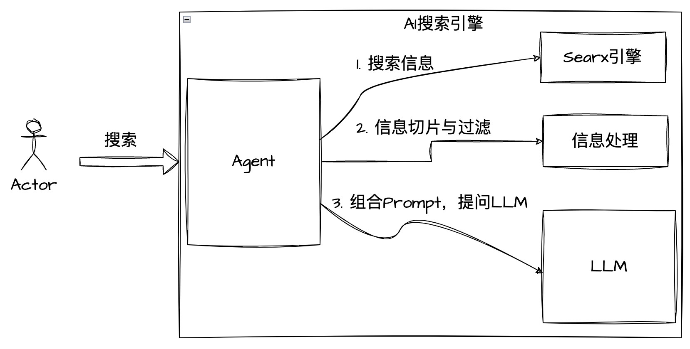

# 🔍 LangChain-SearXNG

简体中文 | [English](README-en.md)

<p>
	<p align="center">
		
	</p>
	<p align="center">
		<br>
		<b face="雅黑">基于LangChain和SearXNG打造的开源AI搜索引擎</b>
	<p>
</p>
<p align="center">


</p>

## 🚀 Quick Install

### 1. 部署 SearXNG

> 由于 SearXNG 需要访问外网，建议部署选择外网服务器  
> 以下部署示例选择以腾讯云轻量服务器-Centos 系统为例

根据 [searxng-docker](https://github.com/searxng/searxng-docker)教程，按照以下操作，容器化部署 SearXNG

```shell
# 拉取代码
git clone https://github.com/searxng/searxng-docker.git
cd searxng-docker

# 修改域名和录入邮箱
vim .env

# 启动docker
docker compose up
```

### 2.部署 Python 环境

- 安装 miniconda

```shell
mkdir ~/miniconda3
wget https://repo.anaconda.com/miniconda/Miniconda3-latest-Linux-x86_64.sh -O ~/miniconda3/miniconda.sh
bash ~/miniconda3/miniconda.sh -b -u -p ~/miniconda3
rm -rf ~/miniconda3/miniconda.sh
~/miniconda3/bin/conda init bash
```

- 创建虚拟环境

```shell
# 创建环境
conda create -n DeepRead python==3.10.11
```

- 安装 poetry

```shell
# 安装
curl -sSL https://install.python-poetry.org | python3 -
```

### 3. 运行 LangChain-SearXNG

- 安装依赖

```shell
# 克隆项目代码到本地
git clone https://github.com/ptonlix/LangChain-SearXNG.git
conda activate LangChain-SearXNG # 激活环境
cd LangChain-SearXNG # 进入项目
poetry install # 安装依赖
```

- 修改配置文件

[OpenAI 文档](https://platform.openai.com/docs/introduction)  
[ZhipuAI 文档](https://open.bigmodel.cn/dev/howuse/introduction)  
[LangChain API](https://smith.langchain.com)

```shell
# settings.yaml

配置文件录入或通过环境变量设置以下变量

# OPENAI 大模型API
OPENAI_API_BASE
OPENAI_API_KEY

# ZHIPUAI 智谱API
ZHIPUAI_API_KEY

# LangChain调试 API
LANGCHAIN_API_KEY

# SearXNG请求地址
SEARX_HOST

```

- 启动项目

```shell
# 启动项目
python -m langchain_searxng

# 查看API
访问: http://localhost:8002/docs 获取 API 信息
```

## 🎸 项目介绍

---

### [帝阅介绍](https://dread.run/#/)

> 「帝阅」  
> 是一款个人专属知识管理与创造的 AI Native 产品  
> 为用户打造一位专属的侍读助理，帮助提升用户获取知识效率和发挥创造力  
> 让用户更好地去积累知识、管理知识、运用知识

LangChain-SearXNG 是帝阅项目一个子项目，我们决定开源出来，与大家交流学习

同时，欢迎大家前往体验[帝阅](https://dread.run/#/) 给我们提出宝贵的建议

---

<p align="center">
	
</p>

目前 LLM Agent 本质上都是使用了 Prompt+Tool 两个方面的能力
以我们 AI 搜索引擎 Agent 为例：

1. 将根据用户搜索关键词，去调用 Tool 收集信息
2. 将收集到的信息通过与 system prompt 等提示词组合，输入到大模型
3. 大模型将依据收集到的上下文，提供更符合用户要求的搜索答案

本项目通过构建 SearXNG 搜索引擎 Tool + LangChain LCEL 调用方式构成-AI 搜索引擎 Agent，以 Fastapi 对外提供服务

### 1. 目录结构

```
├── docs  # 文档
├── langchain_searxng
│   ├── components #自定义组件
│   ├── server # API服务
│   ├── settings # 配置服务
│   ├── utils
│   ├── constants.py
│   ├── di.py
│   ├── launcher.py
│   ├── main.py
│   ├── paths.py
│   ├── __init__.py
│   ├── __main__.py #入口
│   └── __version__.py
├── log # 日志目录
```

### 2. 功能介绍

- 支持查询结果 http sse 流示和整体返回
- 支持联网查询 QA 和直接 QA 切换
- 支持 Token 计算（含 embedding）
- 支持 openai 和 zhipuai 两种大模型

## 🚩 Roadmap

- [x] 搭建 LangChain-SearXNG 初步框架，完善基本功能
- [ ] 完善 网站页面内容爬取效果
  - [ ] 支持网络访问异常处理，方便国内环境使用
- [ ] 支持更多模型
  - [ ] 在线大模型
  - [ ] 本地大模型
- [ ] 搭建前端 Web Demo
  - [ ] 选择 LLM

## 🌏 项目交流讨论


🎉 扫码联系作者，如果你也对本项目感兴趣  
🎉 欢迎加入 LangChain-SearXNG (帝阅开发社区) 项目群参与讨论交流

## 💥 贡献

欢迎大家贡献力量，一起共建 LangChain-SearXNG，您可以做任何有益事情

- 报告错误
- 建议改进
- 文档贡献
- 代码贡献  
  ...  
  👏👏👏

<p align="center">
	<br> 
	<b face="雅黑">帝阅DeepRead</b>
</p>
