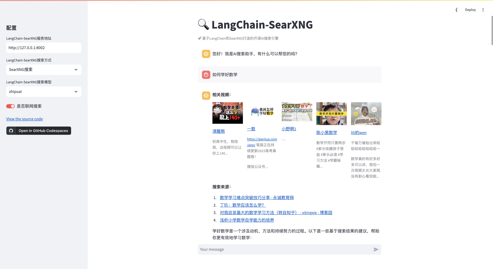
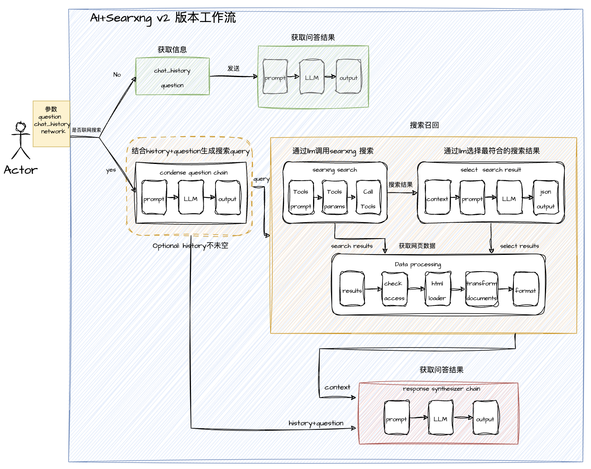

# 🔍 LangChain-SearXNG

简体中文 | [English](README-en.md)

<p>
	<p align="center">
		
	</p>
	<p align="center">
		<br>
		<b face="雅黑">基于LangChain和SearXNG打造的开源AI搜索引擎</b>
	<p>
</p>
<p align="center">


</p>

🌟🌟🌟  
**重要更新： LangChain-SearXNG 全面升级到 v2 版本, 支持更快搜索更精准问答**🚀🔥💥  
🌟🌟🌟

## 🚀 Quick Install

### 1. 部署 SearXNG

> 由于 SearXNG 需要访问外网，建议部署选择外网服务器  
> 以下部署示例选择以腾讯云轻量服务器-Centos 系统为例

根据 [searxng-docker](https://github.com/searxng/searxng-docker)教程，按照以下操作，容器化部署 SearXNG

```shell
# 拉取代码
git clone https://github.com/searxng/searxng-docker.git
cd searxng-docker

# 修改域名和录入邮箱
vim .env

# 修改searxng配置文件 searxng/settings.yml
# 注意修改 limiter 和search，其它参数保持原配置文件不变
# see https://docs.searxng.org/admin/settings/settings.html#settings-use-default-settings
use_default_settings: true
server:
  limiter: false  # can be disabled for a private instance
search:
  formats:
    - html
    - json

# 启动docker
docker compose up
```

### 2.部署 Python 环境

- 安装 miniconda

```shell
mkdir ~/miniconda3
wget https://repo.anaconda.com/miniconda/Miniconda3-latest-Linux-x86_64.sh -O ~/miniconda3/miniconda.sh
bash ~/miniconda3/miniconda.sh -b -u -p ~/miniconda3
rm -rf ~/miniconda3/miniconda.sh
~/miniconda3/bin/conda init bash
```

- 创建虚拟环境

```shell
# 创建环境
conda create -n LangChain-SearXNG python==3.10.11
```

- 安装 poetry

```shell
# 安装
curl -sSL https://install.python-poetry.org | python3 -
```

### 3. 运行 LangChain-SearXNG

- 安装依赖

```shell
# 克隆项目代码到本地
git clone https://github.com/ptonlix/LangChain-SearXNG.git
conda activate LangChain-SearXNG # 激活环境
cd LangChain-SearXNG # 进入项目
poetry install # 安装依赖
```

- 修改配置文件

[OpenAI 文档](https://platform.openai.com/docs/introduction)  
[ZhipuAI 文档](https://open.bigmodel.cn/dev/howuse/introduction)  
[LangChain API](https://smith.langchain.com)

```shell
# settings.yaml

配置文件录入或通过环境变量设置以下变量

# 根据自身环境选择合适的 大模型API
# OPENAI 大模型API
OPENAI_API_BASE
OPENAI_API_KEY

# ZHIPUAI 智谱API
ZHIPUAI_API_KEY
ZHIPUAI_API_BASE

# DeepSeek 大模型API
DEEPSPEAK_API_KEY
DEEPSPEAK_API_BASE

# LangChain调试 API
LANGCHAIN_API_KEY

# SearXNG请求地址
SEARX_HOST

```

详情配置文件介绍见: [LangChain-SearXNG 配置](./docs/config.md)

- 启动项目

```shell
# 启动项目
python -m langchain_searxng

# 查看API
访问: http://localhost:8002/docs 获取 API 信息

# 启动前端页面
cd webui
streamlit run webui.py
```

<p align="center">
	<br>
  <b face="雅黑">WebUI展示</b>
</p>

- 搜索问答模式

目前项目搜索 API 已升级到 v2 版本，下面例子请求使用 v2 版本进行体验

请求参数：

```shell
{
    "question": "目前中国新能源汽车厂商排行榜是什么", #提问问题
    "chat_history": [], #历史聊天记录
    "network": true, #是否开启联网
    "conversation_id": "", #提问的UUID
    "llm": "zhipuai", #采用的大模型
    "retriever": "searx" # 采用的召回模式

}
```

目前支持两种搜索模式 `Searxng` 和 `智谱WebSearch`,这两种模式启用主要根据输入的请求参数`llm`h 和`retriever`控制

**I. 开启 智谱 WebSearch**

对应 Webui 页面 ➡️ 智谱搜索

```shell
{
    ...
    "llm": "zhipuwebsearch", #大模型必须选择zhipuwebsearch (智谱搜索定制模型)
    "retriever": "zhipuwebsearch" #召回模式选择 zhipuwebsearch

}
```

**Ⅱ. 开启 AI+SearXNG V2 版本**

对应 Webui 页面 ➡️ SearXNG 搜索

```shell
{
    ...
    "llm": "deepseek", #可选：默认openai,可选zhipuai,可选deepseek
    "retriever": "searx" #可选：默认searx

}
```

## 🆚 搜索模式效果对比

|   🎨 能力   |           AI+SearXNGv1            |            AI+SearXNGv2             |            智谱 WebSearch             |             360AI 搜索              |
| :---------: | :-------------------------------: | :---------------------------------: | :-----------------------------------: | :---------------------------------: |
| 🚀 响应速度 |              🌟🌟🌟               |              🌟🌟🌟🌟               |              🌟🌟🌟🌟🌟               |              🌟🌟🌟🌟               |
| 📝 内容质量 |              🌟🌟🌟               |              🌟🌟🌟🌟               |                🌟🌟🌟                 |             🌟🌟🌟🌟🌟              |
| 💦 流式响应 | 1. 搜索过程支持<br>2.搜索结果支持 | 1. 搜索过程支持 <br> 2.搜索结果支持 | 1. 搜索过程不支持 <br> 2.搜索结果支持 | 1. 搜索过程支持 <br> 2.搜索结果支持 |

`AI+SearXNGv2`相较于上个版本从响应速度和内容质量均有明显提升，距离 360AI 搜索更进一步了 💪

详细评测分析: [AI 搜索模式对比测试](./docs/modevs.md)

## ⛓️ 项目介绍

> 本项目通过构建 SearXNG 搜索引擎 Tool + LangChain LCEL 调用方式构建-AI 搜索引擎 Agent，以 Fastapi 对外提供服务

### 1.AI+SearXNGv2 工作流介绍

[v1 版本介绍](./docs/searxngv1.md)

<p align="center">
	<br>
  <b face="雅黑">AI+SearXNG v2版本工作流</b>
</p>

- 通过用户输入的参数控制搜索工作流程，主流程分为`联网搜索问答`和`模型内搜索问答`
- `模型内搜索问答`: 通过获取用户输入`chat_history` `question` 构建 Prompt 输入到 LLM 生成问答结果并返回
- `联网搜索问答`: 主要分为三个部分 `condense question chain` `搜索召回` `response synthesizer chain`

  1.  如果输入的 chat_history 不为空，则进入`condense question chain` 工作流，根据聊天上下文生成最合适的搜索 query
  2.  通过 query 进入`搜索召回` 工作流:分为 `searxng search` `select  search result` `Data processing`三个部分

  - 通过 LLM 根据搜索 query 选择最合适的 searxng 搜索参数，调用 searxng api 搜索结果（通常 20 ～ 30 个搜索结果）
  - 再根据上一步搜索到的结果，通过 LLM 进一步筛选出最合适回答该 query 的搜索结果，通常 6 个
  - 根据确定最合适的搜索结果，进行数据处理：检查可访问性->获取 html->生成 Documents ->format 格式化，最终输出问答上下文`context`

  3.  通过`搜索召回`的上下文 `context`和用户输入的`chat_history` `question`一起进入`response synthesizer chain`工作流，最终生成搜索响应

**v2 对比 v1 版本的差别**

1. v1 版本主要是搜索获取数据，再通过过滤筛选出最佳数据，但如果一开始源数据质量不佳，则后续工作效果就会大减，而且基础源数据数量不多，向量化过滤时间很长。
2. v2 版本一个主要原则是确保源数据质量，搜索结果尽可能符合搜索关键字，所以精心构建了搜索召回工作流，让大模型参与获取最佳搜索结果。同时由于已经筛选出最佳搜索数据，不需要向量化过滤，可以直接 LLM 让生成结果。（Token 越来越便宜也是一大趋势）
3. v2 版本还优化了搜索网页加载流程，尽可能快的获取到搜索数据
4. v2 版本增加搜索过程可视化，在流式返回中，可以动态显示搜索进度，展示更丰富的内容

### 2. 目录结构

```
├── docs  # 文档
├── langchain_searxng
│   ├── components #自定义组件
│   ├── server # API服务
│   ├── settings # 配置服务
│   ├── utils
│   ├── constants.py
│   ├── di.py
│   ├── launcher.py
│   ├── main.py
│   ├── paths.py
│   ├── __init__.py
│   ├── __main__.py #入口
│   └── __version__.py
├── log # 日志目录
├── wwebui # 前端展示页面
```

### 3. 功能介绍

- 支持查询结果 http sse 流式和非流式（整体）返回
- 支持联网查询 QA 和直接 QA 切换
- 支持 Token 计算（含 embedding）
- 支持 openai、zhipuai、deepseek 三种大模型
- 支持 配置文件动态加载
- 支持 智谱 AI 新推出的 WebSearch 功能

## 🚩 Roadmap

- [x] 搭建 LangChain-SearXNG 初步框架，完善基本功能
- [x] 支持配置文件动态加载，方便更改相关参数
- [x] 完善 网站页面内容爬取效果
- [x] 支持网络访问异常处理，方便国内环境使用
- [x] 支持智谱 WebSearch 功能
- [x] 升级 SearXNG 搜索问题,支持更快更精准的回答
- [x] 搭建前端 Web Demo
- [ ] Docker 化项目，便于部署传播
- [x] 支持视频搜索
- [ ] 优化 Prompt，支持输出更丰富的内容

## 🌏 项目交流讨论


🎉 扫码联系作者，如果你也对本项目感兴趣  
🎉 欢迎加入 LangChain-X (帝阅开发社区) 项目群参与讨论交流

## 💥 贡献

欢迎大家贡献力量，一起共建 LangChain-SearXNG，您可以做任何有益事情

- 报告错误
- 建议改进
- 文档贡献
- 代码贡献  
  ...  
  👏👏👏

---

### [帝阅介绍](https://dread.run/#/)

> 「帝阅」  
> 是一款个人专属知识管理与创造的 AI Native 产品  
> 为用户打造一位专属的侍读助理，帮助提升用户获取知识效率和发挥创造力  
> 让用户更好地去积累知识、管理知识、运用知识

LangChain-SearXNG 是帝阅项目一个子项目，我们决定开源出来，与大家交流学习

同时，欢迎大家前往体验[帝阅](https://dread.run/#/) 给我们提出宝贵的建议

---

<p align="center">
	<br> 
	<b face="雅黑">帝阅DeepRead</b>
</p>
